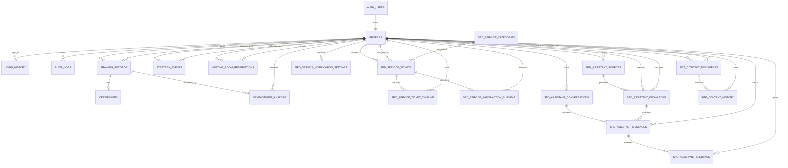
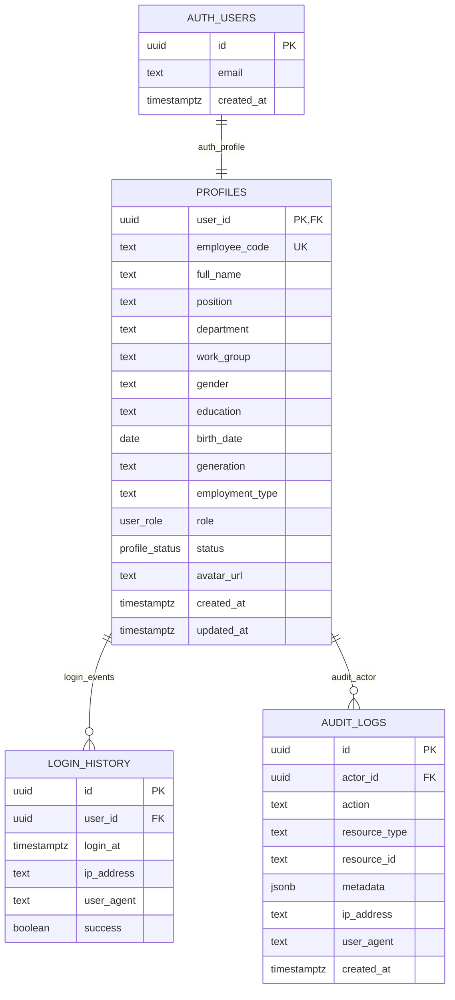
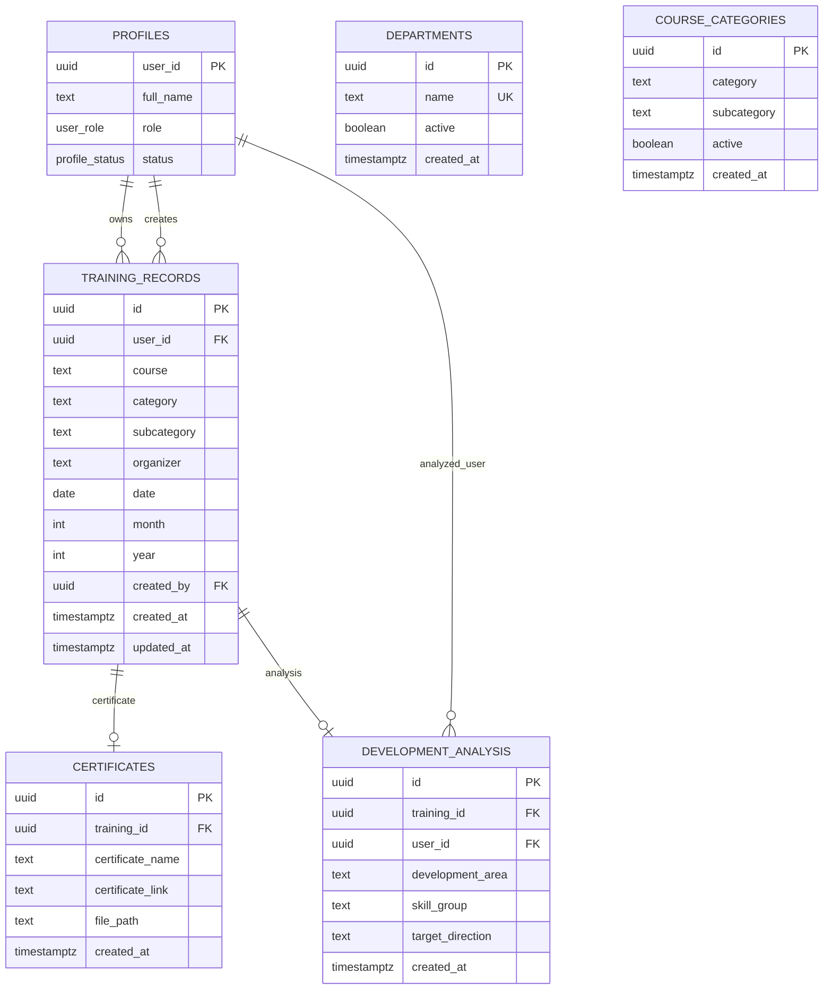
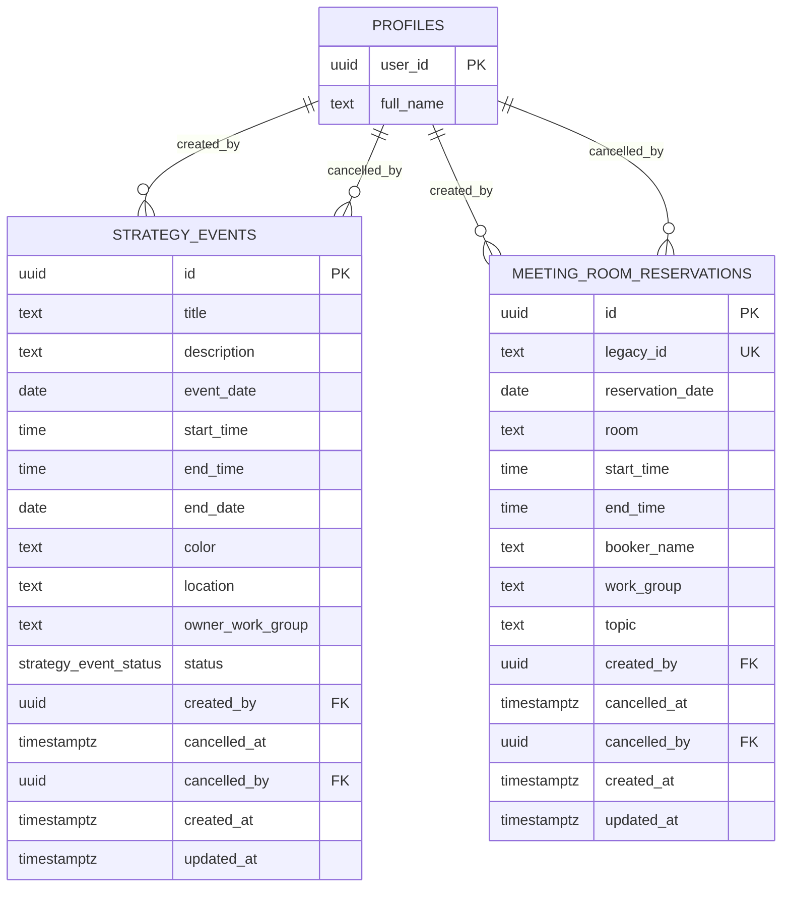
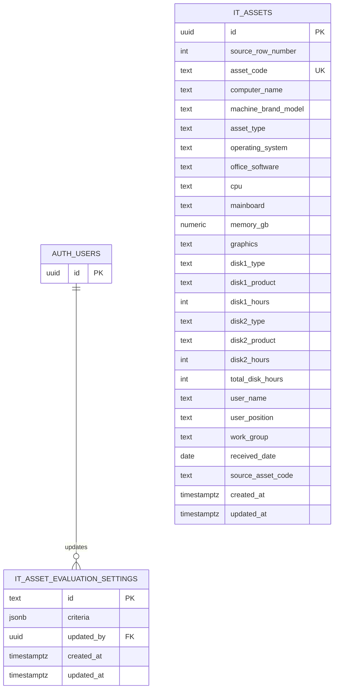
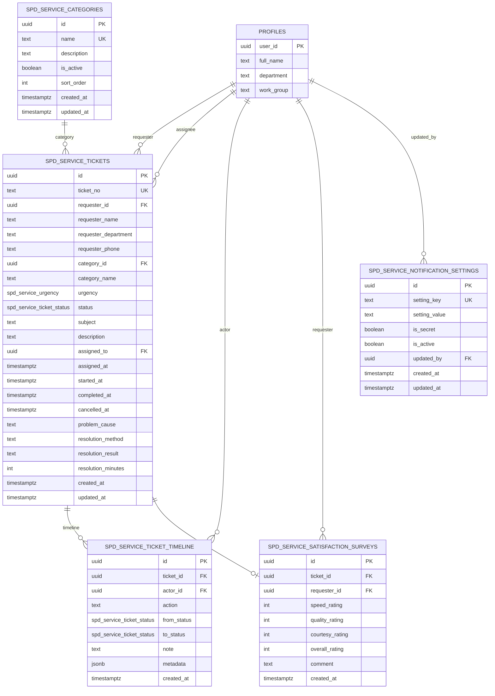
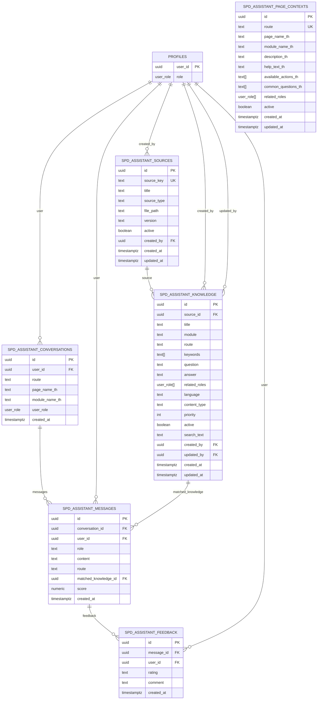
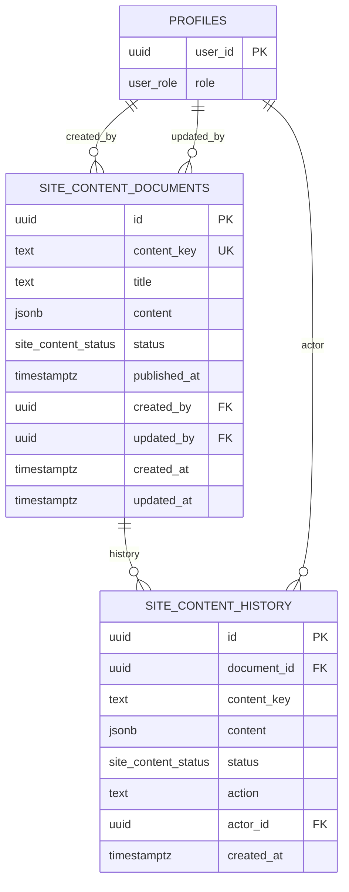
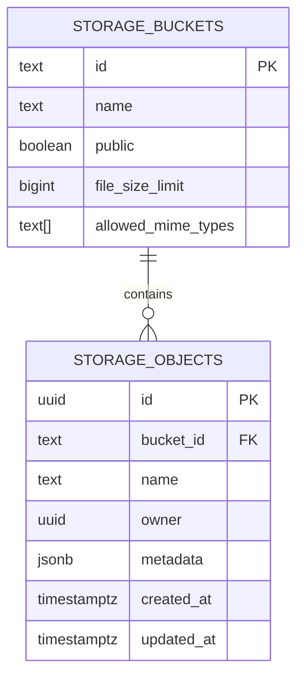

# PTDMS ER Diagrams

เอกสารนี้สรุป Entity Relationship ของระบบ PTDMS จาก `graphify-out/GRAPH_REPORT.md`, migration ใน `supabase/migrations`, และ type definition ใน `src/types/database.types.ts` เพื่อใช้เป็นต้นทางสำหรับสร้าง `er_diagrams.html` ต่อไป

## ภาพรวมระบบ

ระบบใช้ Supabase เป็น backend หลัก โดยมี `auth.users` เป็นบัญชีผู้ใช้ของ Supabase Auth และมี `public.profiles` เป็นโปรไฟล์/บทบาท/สถานะของผู้ใช้ในระบบ PTDMS

โดเมนข้อมูลหลักแบ่งเป็น 8 กลุ่ม

| กลุ่ม | ตารางหลัก | หน้าที่ |
|---|---|---|
| Identity & RBAC | `profiles`, `login_history`, `audit_logs` | ผู้ใช้ บทบาท สถานะ และ audit |
| Training & Development | `training_records`, `certificates`, `development_analysis`, `departments`, `course_categories` | ประวัติอบรม ใบประกาศ และการวิเคราะห์พัฒนา |
| Strategy Calendar | `strategy_events`, `meeting_room_reservations` | ปฏิทินกิจกรรมและการจองห้องประชุม |
| IT Assets | `it_assets`, `it_asset_evaluation_settings` | ทะเบียนครุภัณฑ์ IT และเกณฑ์ประเมิน |
| SPD Service | `spd_service_categories`, `spd_service_tickets`, `spd_service_ticket_timeline`, `spd_service_satisfaction_surveys`, `spd_service_notification_settings` | Helpdesk / service request |
| SPD Assistant | `spd_assistant_sources`, `spd_assistant_knowledge`, `spd_assistant_page_contexts`, `spd_assistant_conversations`, `spd_assistant_messages`, `spd_assistant_feedback` | Knowledge base, conversation log, feedback |
| Site Content | `site_content_documents`, `site_content_history` | เนื้อหา public home และประวัติการแก้ไข |
| Supabase Storage | `storage.buckets`, `storage.objects` | bucket สำหรับ assistant import และ site assets |

## Global ER Diagram

## Identity & RBAC

### Enums

| Enum | Values |
|---|---|
| `user_role` | `super_admin`, `admin`, `executive`, `hr`, `personnel` |
| `profile_status` | `active`, `inactive`, `suspended` |

## Training & Development

### Training Notes

| ประเด็น | รายละเอียด |
|---|---|
| Deduplicate | `training_records` มี unique index จาก `user_id`, `lower(course)`, `date`, `lower(organizer)` |
| Certificate | migration เพิ่ม unique constraint ที่ `certificates.training_id` ทำให้ความสัมพันธ์ตั้งใจเป็น 1 training ต่อ 0..1 certificate |
| Development analysis | migration เพิ่ม unique constraint ที่ `development_analysis.training_id` ทำให้ 1 training ต่อ 0..1 analysis |
| Department/category | ปัจจุบัน `profiles.department`, `training_records.category`, `training_records.subcategory` เก็บเป็น text ไม่ได้ FK ไป `departments` หรือ `course_categories` |

## Strategy Calendar & Meeting Rooms

### Enums และ Constraints

| Entity | Rule |
|---|---|
| `strategy_event_status` | `draft`, `published`, `cancelled` |
| `strategy_events` | `end_time >= start_time` เมื่อมีเวลาเริ่มและสิ้นสุด |
| `meeting_room_reservations.room` | `ห้องประชุม 1`, `ห้องประชุม 2`, `ห้องสมุด` |
| `meeting_room_reservations` | `end_time > start_time` |

## IT Asset Management

### IT Asset Notes

`it_assets` ยังไม่ผูก FK กับ `profiles` เพราะข้อมูลผู้ถือครองเก็บเป็น `user_name`, `user_position`, `work_group` แบบ snapshot จากทะเบียนเดิม เหมาะกับการนำเข้าและตรวจสอบครุภัณฑ์ แต่ถ้าต้องการเชื่อม user จริงในอนาคตควรเพิ่ม `assigned_user_id uuid references profiles(user_id)` แยกจาก snapshot fields

## SPD Service Management

### Enums

| Enum | Values |
|---|---|
| `spd_service_ticket_status` | `NEW`, `ASSIGNED`, `IN_PROGRESS`, `WAITING`, `COMPLETED`, `CANCELLED` |
| `spd_service_urgency` | `LOW`, `MEDIUM`, `HIGH`, `CRITICAL` |

## SPD Assistant

### Assistant Notes

| ประเด็น | รายละเอียด |
|---|---|
| Search | `spd_assistant_knowledge.search_text` ถูกสร้างจาก trigger เพื่อใช้ค้นหาแบบ trigram |
| Access control | Knowledge และ page contexts ใช้ `related_roles user_role[]` ร่วมกับ RLS |
| Conversation | ผู้ใช้เห็น conversation/message ของตัวเอง ส่วน admin/super_admin ใช้เพื่อ governance |
| Feedback | rating จำกัดเป็น `helpful` หรือ `not_helpful` |

## Site Content

### Enums

| Enum | Values |
|---|---|
| `site_content_status` | `published`, `draft`, `scheduled` |

## Storage Buckets

Supabase Storage ไม่ใช่ public schema entity หลักของระบบ แต่มี bucket/policy สำคัญที่ควรแสดงในเอกสาร HTML

| Bucket | Public | Allowed MIME Types | ใช้กับ |
|---|---:|---|---|
| `spd-assistant-imports` | false | `application/json`, `text/markdown`, `text/plain` | นำเข้าฐานความรู้ SPD Assistant |
| `site-content-assets` | true | `image/png`, `image/jpeg`, `image/webp`, `image/svg+xml` | รูป/โลโก้/asset สำหรับ public website |

## Relationship Matrix

| From | To | Cardinality | FK / Field | Delete behavior |
|---|---|---:|---|---|
| `auth.users` | `profiles` | 1:1 | `profiles.user_id` | cascade |
| `profiles` | `login_history` | 1:N | `login_history.user_id` | set null |
| `profiles` | `audit_logs` | 1:N | `audit_logs.actor_id` | set null |
| `profiles` | `training_records` | 1:N | `training_records.user_id` | cascade |
| `profiles` | `training_records` | 1:N | `training_records.created_by` | set null |
| `training_records` | `certificates` | 1:0..1 | `certificates.training_id` | cascade |
| `training_records` | `development_analysis` | 1:0..1 | `development_analysis.training_id` | cascade |
| `profiles` | `development_analysis` | 1:N | `development_analysis.user_id` | cascade |
| `profiles` | `strategy_events` | 1:N | `created_by`, `cancelled_by` | set null |
| `profiles` | `meeting_room_reservations` | 1:N | `created_by`, `cancelled_by` | set null |
| `profiles` | `spd_service_tickets` | 1:N | `requester_id` | restrict |
| `profiles` | `spd_service_tickets` | 1:N | `assigned_to` | set null |
| `spd_service_categories` | `spd_service_tickets` | 1:N | `category_id` | set null |
| `spd_service_tickets` | `spd_service_ticket_timeline` | 1:N | `ticket_id` | cascade |
| `spd_service_tickets` | `spd_service_satisfaction_surveys` | 1:0..1 | `ticket_id` | cascade |
| `profiles` | `spd_service_ticket_timeline` | 1:N | `actor_id` | set null |
| `profiles` | `spd_service_satisfaction_surveys` | 1:N | `requester_id` | restrict |
| `profiles` | `spd_service_notification_settings` | 1:N | `updated_by` | set null |
| `profiles` | `spd_assistant_sources` | 1:N | `created_by` | set null |
| `spd_assistant_sources` | `spd_assistant_knowledge` | 1:N | `source_id` | set null |
| `profiles` | `spd_assistant_knowledge` | 1:N | `created_by`, `updated_by` | set null |
| `profiles` | `spd_assistant_conversations` | 1:N | `user_id` | set null |
| `spd_assistant_conversations` | `spd_assistant_messages` | 1:N | `conversation_id` | cascade |
| `profiles` | `spd_assistant_messages` | 1:N | `user_id` | set null |
| `spd_assistant_knowledge` | `spd_assistant_messages` | 1:N | `matched_knowledge_id` | set null |
| `spd_assistant_messages` | `spd_assistant_feedback` | 1:N | `message_id` | cascade |
| `profiles` | `spd_assistant_feedback` | 1:N | `user_id` | set null |
| `profiles` | `site_content_documents` | 1:N | `created_by`, `updated_by` | set null |
| `site_content_documents` | `site_content_history` | 1:N | `document_id` | cascade |
| `profiles` | `site_content_history` | 1:N | `actor_id` | set null |
| `auth.users` | `it_asset_evaluation_settings` | 1:N | `updated_by` | set null |

## Tables Without Hard FK

| Table / Field | เหตุผลหรือสถานะปัจจุบัน | ข้อเสนอหากต้อง normalize |
|---|---|---|
| `profiles.department` | เก็บชื่อหน่วยงานเป็น text | เพิ่ม `department_id uuid references departments(id)` |
| `profiles.work_group` | เก็บกลุ่มงานเป็น text | เพิ่มตาราง `work_groups` หรือใช้ `departments` แบบ hierarchy |
| `training_records.category`, `subcategory` | เก็บ snapshot ของ category/subcategory | เพิ่ม `course_category_id uuid references course_categories(id)` |
| `it_assets.user_name`, `user_position`, `work_group` | snapshot จากทะเบียนครุภัณฑ์ | เพิ่ม `assigned_user_id uuid references profiles(user_id)` |
| `meeting_room_reservations.booker_name`, `work_group` | เก็บชื่อผู้จองแบบ text เพื่อรองรับข้อมูล legacy | เพิ่ม `booker_user_id uuid references profiles(user_id)` |

## Recommended HTML Sections

เมื่อนำไปสร้าง `er_diagrams.html` แนะนำให้แบ่งหน้าเป็น tabs หรือ anchor sections ดังนี้

1. Overview
2. Global ER
3. Identity & RBAC
4. Training & Development
5. Strategy Calendar
6. IT Assets
7. SPD Service
8. SPD Assistant
9. Site Content
10. Storage
11. Relationship Matrix
12. Normalization Notes

## Source References

| Source | ใช้สำหรับ |
|---|---|
| `graphify-out/GRAPH_REPORT.md` | แยก community/domain ของระบบ |
| `supabase/migrations/202605080001_auth_rbac_foundation.sql` | Auth, profiles, login history, audit logs |
| `supabase/migrations/202605080002_training_domain_schema.sql` | Training, certificates, development analysis |
| `supabase/migrations/202605260001_extend_profiles_user_management.sql` | Profile demographic fields |
| `supabase/migrations/202606040001_create_strategy_events.sql` | Strategy calendar |
| `supabase/migrations/202606090001_create_it_assets.sql` | IT assets |
| `supabase/migrations/202606090002_create_spd_assistant.sql` | SPD Assistant |
| `supabase/migrations/202606100001_create_it_asset_evaluation_settings.sql` | IT asset evaluation settings |
| `supabase/migrations/202606110001_create_spd_service.sql` | SPD service management |
| `supabase/migrations/202606120001_create_meeting_room_reservations.sql` | Meeting room reservations |
| `supabase/migrations/202606150001_create_site_content.sql` | Site content documents/history |
| `supabase/migrations/202606150007_create_site_content_assets.sql` | Storage bucket/policies for site assets |
| `src/types/database.types.ts` | Frontend type names and current app-facing schema |
